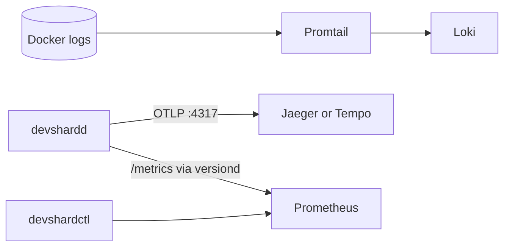
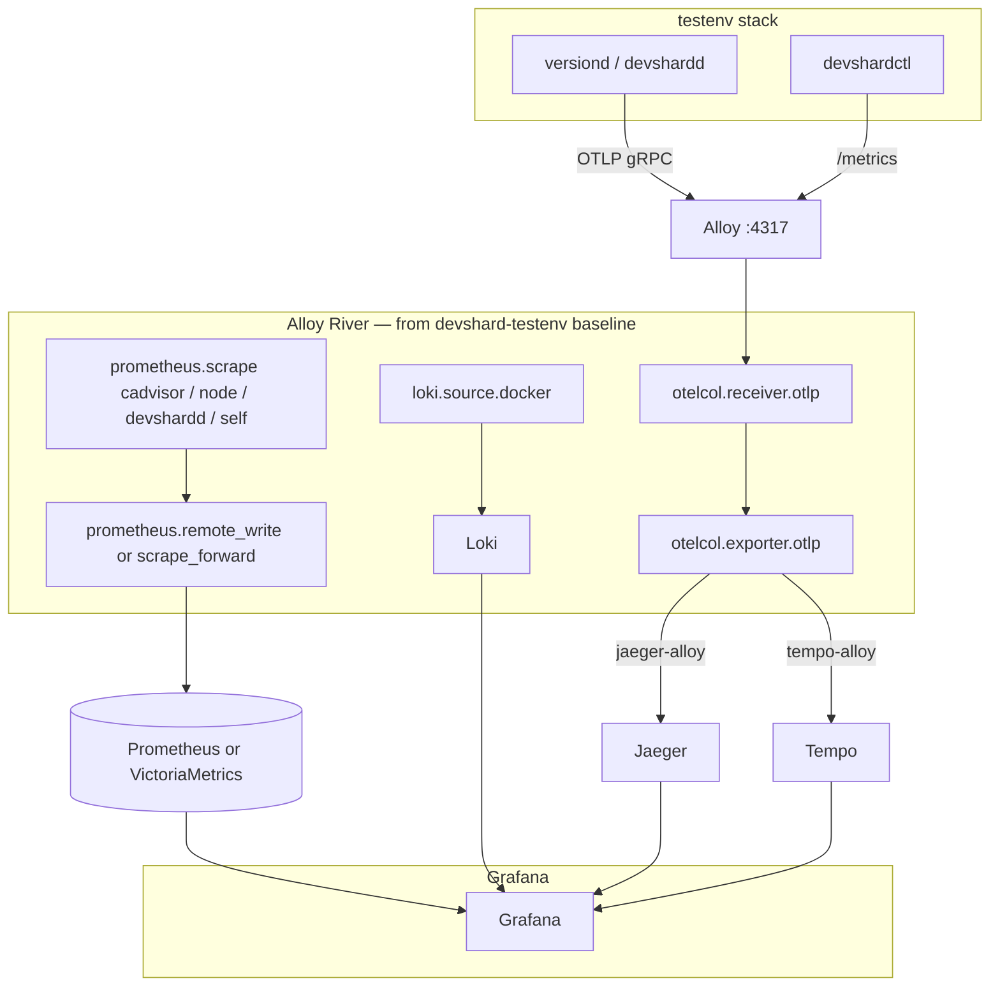

# testenv observability plan

**Scope:** optional Docker overlay for `devshard/testenv` (Phase 10).  
**Related:** [testenv-v2-plan.md](./testenv-v2-plan.md) §Phase 10, [README.md](../README.md) §Phase 10, `deploy/join/docker-compose.observability.yml`.

---

## Goals

1. **Ship today:** Jaeger + Prometheus + Loki + Promtail + Grafana — enough to see devshardd spans, structured logs, and `/metrics` during citest and manual debugging.
2. **Support selectable backends** without duplicating the whole stack:
   - **Traces:** Jaeger **or** Grafana Tempo (storage/query only — not app-facing when Alloy is on)
   - **Log collection:** Promtail **or** Grafana Alloy
3. **When Alloy is enabled**, Alloy is the **single telemetry agent**: metrics scrape, Docker logs → Loki, **and OTLP trace ingest**. Apps never talk to Jaeger/Tempo directly.
4. **Mirror** the working River config from branch **`devshard-testenv`**, then extend it for **Jaeger** export (that branch only planned Tempo).
5. **One OTEL contract** for devshardd: `DEVSHARD_OTEL_ENABLED` + `OTEL_ENDPOINT` (gRPC OTLP `:4317`).

---

## Reference implementation (`devshard-testenv` branch)

The **`devshard-testenv`** branch already ships a tuned Alloy pipeline. Treat it as the **source of truth** for River layout; port into this stack rather than reinventing Promtail-equivalent logic.

| Path on `devshard-testenv` | Role |
|----------------------------|------|
| `devshard/testenv/observability/alloy/config.alloy` | River pipeline (metrics + logs) |
| `devshard/testenv/observability/compose-fragment.yaml` | Alloy, cAdvisor, node-exporter, VictoriaMetrics, Loki, Grafana |
| `devshard/testenv/OBSERVABILITY.md` | Operator runbook |
| `devshard/testenv/observability/README.md` | Sync notes with `subnet-testenv` |

**What that Alloy config does today (working):**

| Pipeline block | Target |
|----------------|--------|
| `prometheus.scrape "cadvisor"` + relabel | VictoriaMetrics (`remote_write`) |
| `prometheus.scrape "node_exporter"` | VictoriaMetrics |
| `prometheus.scrape "devshardd"` | `devshardd-testenv-*:9600/metrics` → VM |
| `prometheus.scrape "alloy_self"` | Alloy self-metrics |
| `discovery.docker` → `loki.source.docker` → `loki.write` | Loki (`:3100`) |
| `loki.process` | Drops `/health` noise |

**Comment in config (not yet implemented on that branch):**

```text
// Phase 3 (upcoming): traces
//   devshard hosts  → OTLP traces  → Tempo
```

**This plan:** land that Phase 3 block as **`otelcol.receiver.otlp` on Alloy**, with the exporter switched by profile to **Tempo or Jaeger** (extension beyond `devshard-testenv`).

**Sync rule** (from `observability/README.md` on that branch): keep cAdvisor relabel, Loki docker discovery, and healthcheck drop **in lockstep** with `subnet/testenv/observability/alloy/config.alloy` on `subnet-testenv` when tuning shared graph pieces.

---

## Current stack (implemented on main — Phase 10)

| Role | Component | Image (pinned) | Host port | Notes |
|------|-----------|----------------|-----------|-------|
| Trace backend | **Jaeger** v2 | `jaegertracing/jaeger:2.17.0` | `11686` UI | OTLP gRPC `:4317` — **app talks here directly** |
| Metrics store | **Prometheus** | `prom/prometheus:v3.11.3` | `19099` | Static scrape of `devshardctl`, `versiond-*/<version>/metrics` |
| Log store | **Loki** | `grafana/loki:3.6.10` | `13101` | Filesystem TSDB |
| Log shipper | **Promtail** | `grafana/promtail:3.6.10` | — | Docker SD |
| UI | **Grafana** | `grafana/grafana:13.0.1` | `13000` | Prometheus, Loki, Jaeger datasources |

Profile: **`jaeger-promtail`** (implicit default).

| Env (versiond → devshardd child) | Value |
|----------------------------------|-------|
| `TESTENV_OTEL_ENABLED` | `true` |
| `TESTENV_OTEL_ENDPOINT` | `http://jaeger:4317` |

O1 citest (`make citest-observability`) asserts Jaeger spans, Loki logs, Prometheus metrics.

---

## Target architecture

### Promtail profiles — direct OTLP to trace backend

Apps export traces **straight to the trace store** (same as join stack today).



| Profile | `TESTENV_OTEL_ENDPOINT` | Log collector |
|---------|---------------------------|---------------|
| `jaeger-promtail` | `http://jaeger:4317` | Promtail |
| `tempo-promtail` | `http://tempo:4317` | Promtail |

### Alloy profiles — Alloy is the OTLP ingress (and unified agent)

**Rule:** when any `*-alloy` profile is active, **`TESTENV_OTEL_ENDPOINT` is always `http://alloy:4317`**. Jaeger and Tempo only receive spans **from Alloy’s OTLP exporter**, not from devshardd.



| Profile | `TESTENV_OTEL_ENDPOINT` | Alloy trace export |
|---------|---------------------------|-------------------|
| `jaeger-alloy` | **`http://alloy:4317`** | `otelcol.exporter.otlp` → `jaeger:4317` |
| `tempo-alloy` | **`http://alloy:4317`** | `otelcol.exporter.otlp` → `tempo:4317` |

**Alloy UI:** `http://127.0.0.1:12345` — pipeline graph should show OTLP receiver + active trace exporter (green).

---

## Backend selection

### Environment variables

| Variable | Values | Default | Effect |
|----------|--------|---------|--------|
| `TESTENV_OBS_PROFILE` | `jaeger-promtail` \| `jaeger-alloy` \| `tempo-promtail` \| `tempo-alloy` | `jaeger-promtail` | Compose fragments + Alloy River variant |
| `TESTENV_OTEL_ENABLED` | `true` \| `false` | `false` | Passed to versiond → devshardd |
| `TESTENV_OTEL_ENDPOINT` | OTLP URL | **derived from profile** | See tables above — **never** point apps at Tempo/Jaeger when profile ends in `-alloy` |

`PrepareObservabilityOverlay` / Makefile must set `TESTENV_OTEL_ENDPOINT` from profile; hand-editing is error-prone.

### `TESTENV_OTEL_ENDPOINT` matrix

| Profile | App OTLP target | Trace storage |
|---------|-----------------|---------------|
| `jaeger-promtail` | `http://jaeger:4317` | Jaeger |
| `tempo-promtail` | `http://tempo:4317` | Tempo |
| `jaeger-alloy` | **`http://alloy:4317`** | Jaeger (via Alloy) |
| `tempo-alloy` | **`http://alloy:4317`** | Tempo (via Alloy) |

### Compose layout (proposed)

Port layout from **`devshard-testenv`** `compose-fragment.yaml` where Alloy is used (IPs `172.30.0.100+` on that branch; this stack uses `.60+` — keep one map per overlay).

```
devshard/testenv/
  observability/
    alloy/
      config.alloy              # base: port from devshard-testenv branch
      config.jaeger.alloy       # optional: trace exporter → jaeger (or River `// +profile` blocks)
      config.tempo.alloy        # optional: trace exporter → tempo
    compose-fragment.yaml       # optional: full VM+cAdvisor+Alloy stack from devshard-testenv
  docker-compose.observability.yml          # shared: loki, grafana, prometheus (promtail path)
  docker-compose.observability.ip.yml
  docker-compose.observability.jaeger.yml
  docker-compose.observability.tempo.yml
  docker-compose.observability.promtail.yml
  docker-compose.observability.alloy.yml    # alloy + cAdvisor + node-exporter (from fragment)
```

**Profile → fragments**

| Profile | Fragments |
|---------|-----------|
| `jaeger-promtail` | shared + `jaeger` + `promtail` + `ip` |
| `jaeger-alloy` | shared + `jaeger` + `alloy` + `ip` |
| `tempo-promtail` | shared + `tempo` + `promtail` + `ip` |
| `tempo-alloy` | shared + `tempo` + `alloy` + `ip` |

Mutually exclusive: **Promtail xor Alloy**, **Jaeger xor Tempo** (storage), but Alloy always present in `*-alloy` profiles.

---

## Alloy River config (port from `devshard-testenv`, extend for Jaeger)

### Baseline — copy from branch

Start from:

```bash
git show devshard-testenv:devshard/testenv/observability/alloy/config.alloy
```

**Adapt for versiond stack (main testenv):**

| `devshard-testenv` scrape target | Main testenv equivalent |
|----------------------------------|-------------------------|
| `devshardd-testenv-0:9600` … | `versiond-0:8080/<version>/metrics` (or dedicated metrics port if exposed) |
| `devshardctl` | `devshardctl:<port>/metrics` |
| VictoriaMetrics `remote_write` | Keep VM **or** `prometheus.remote_write` → Prometheus — pick one metrics store per profile family |

Keep unchanged from branch: **cAdvisor** relabel rules, **node-exporter** scrape, **docker log** pipeline (`discovery.docker`, `loki.relabel.promote_service_name`, healthcheck drop).

### Add — OTLP receiver (all `*-alloy` profiles)

Expose gRPC on `0.0.0.0:4317` inside the Alloy container; publish only on the `testenv` network (no host bind required — apps use `alloy:4317`).

```alloy
// OTLP ingress — apps use TESTENV_OTEL_ENDPOINT=http://alloy:4317
otelcol.receiver.otlp "devshard" {
  grpc {
    endpoint = "0.0.0.0:4317"
  }
  output {
    traces = [otelcol.exporter.otlp.trace_backend.input]
  }
}
```

Compose: ensure nothing else binds `4317` on the Alloy service (Jaeger/Tempo keep their receivers on **backend** ports only reachable from Alloy).

### Add — trace exporter switch (Jaeger **or** Tempo)

**Jaeger profile** (`jaeger-alloy`) — extension beyond `devshard-testenv` (which only commented Tempo):

```alloy
otelcol.exporter.otlp "trace_backend" {
  client {
    endpoint = "jaeger:4317"
    tls {
      insecure = true
    }
  }
}
```

**Tempo profile** (`tempo-alloy`) — matches original `devshard-testenv` intent:

```alloy
otelcol.exporter.otlp "trace_backend" {
  client {
    endpoint = "tempo:4317"
    tls {
      insecure = true
    }
  }
}
```

Implementation options:

1. **Two River files** mounted per profile (`config.jaeger.alloy` vs `config.tempo.alloy`), or
2. **Single file** with gencompose/harness substituting `endpoint = "…"` when copying into citest workdir.

Verify in Alloy UI (`:12345`) that `otelcol.receiver.otlp` → `otelcol.exporter.otlp` is connected and spans increment after gateway chat.

### Metrics path when Alloy is on

Mirror **`devshard-testenv`**: Alloy scrapes; do **not** also run parallel Promtail **or** duplicate Prometheus scrape jobs for the same targets.

| Approach | Notes |
|----------|-------|
| **A — VM (match branch)** | `prometheus.remote_write` → VictoriaMetrics; Grafana datasource = VM |
| **B — Prometheus (match Phase 10)** | `prometheus.scrape` → `prometheus.remote_write` to Prometheus or use `prometheus.scrape` `forward_to` native Prometheus federation — simpler if we keep `prometheus.yml` |

Default recommendation for **main testenv**: **B** short-term (reuse Phase 10 Prometheus + dashboards); optional **A** when aligning fully with `devshard-testenv` compose fragment.

---

## Trace backends (storage only when Alloy is on)

### Jaeger

| Item | Promtail profile | Alloy profile |
|------|------------------|---------------|
| App `OTEL_ENDPOINT` | `http://jaeger:4317` | **`http://alloy:4317`** |
| Ingest | Jaeger OTLP receiver | Alloy → `otelcol.exporter.otlp` → `jaeger:4317` |
| Query UI | `http://127.0.0.1:11686/jaeger/` | same |
| Citest | Jaeger HTTP API | same (storage unchanged) |

Config: existing `observability/jaeger.config.yaml`.

### Tempo

| Item | Promtail profile | Alloy profile |
|------|------------------|---------------|
| App `OTEL_ENDPOINT` | `http://tempo:4317` | **`http://alloy:4317`** |
| Ingest | Tempo OTLP receiver | Alloy → `otelcol.exporter.otlp` → `tempo:4317` |
| Query | Grafana Explore → Tempo | same |

Reserved IP on `devshard-testenv` fragment: `172.30.0.106` for Tempo — map into this stack’s `ip.yml` when adding the service.

---

## Log collectors

### Promtail (current — `*-promtail` profiles)

Direct Docker SD → Loki. No Alloy. See `observability/promtail-config.yaml`.

### Alloy ( `*-alloy` profiles)

Use **branch config as-is** for logs (`loki.source.docker` pipeline). Do not run Promtail concurrently.

| Item | Detail |
|------|--------|
| Source | `devshard-testenv:observability/alloy/config.alloy` |
| Image | `grafana/alloy:v1.15.0` (pin from branch; ≥ v1.15 for River features used) |
| UI | `127.0.0.1:12345` |
| Depends on | cAdvisor + node-exporter + Loki (per `compose-fragment.yaml`) |

**Service name relabel:** branch strips `-N` suffix (`versiond-0` → `service_name=versiond`) — adjust regex if compose service names differ from `devshardd-testenv-*`.

---

## Grafana provisioning

| Datasource | Promtail + Prometheus path | Alloy + VM path (branch) |
|------------|------------------------------|---------------------------|
| Metrics | Prometheus `:19099` | VictoriaMetrics `:8428` |
| Logs | Loki | Loki |
| Traces | Jaeger or Tempo | Jaeger or Tempo (query only) |

Loki **derivedFields** → trace uid: `jaeger` or `tempo` (unchanged).

---

## devshardd instrumentation (app layer)

Unchanged:

| Mechanism | Detail |
|-----------|--------|
| OTel init | `devshard/observability.Init` |
| Spans | `devshardd.request`, `devshardd.inference`, … |
| Logs | `observability.Log` — `stage`, `where`, `request_id` |
| Metrics | `/metrics` on devshardd |

**App rule:** devshardd only needs a reachable OTLP URL. Profile chooses **direct backend** vs **Alloy hop** via `TESTENV_OTEL_ENDPOINT` only — no code forks per backend.

---

## Implementation phases

### Phase A — Document + align with `devshard-testenv` ✅ / in progress

| Task | Done |
|------|------|
| This plan (Alloy OTLP ingress, branch mirror) | ✅ |
| Link from testenv-v2-plan Phase 10 | ✅ |

### Phase B — Port Alloy baseline from `devshard-testenv`

| Task | Done |
|------|------|
| Copy `observability/alloy/config.alloy` + `compose-fragment.yaml` pieces (Alloy, cAdvisor, node-exporter) | |
| Adapt `prometheus.scrape "devshardd"` targets for `versiond-*` / `devshardctl` | |
| `docker-compose.observability.alloy.yml` + static IP | |
| `TESTENV_OTEL_ENDPOINT=http://alloy:4317` for `*-alloy` profiles | |

### Phase C — OTLP through Alloy + Jaeger export

| Task | Done |
|------|------|
| `otelcol.receiver.otlp` on `:4317` in Alloy | |
| `otelcol.exporter.otlp` → `jaeger:4317` for `jaeger-alloy` | |
| O1 on `jaeger-alloy` (Jaeger API assertions unchanged) | |
| Alloy UI shows trace pipeline | |

### Phase D — Tempo + `tempo-alloy`

| Task | Done |
|------|------|
| Tempo compose + config | |
| `otelcol.exporter.otlp` → `tempo:4317` for `tempo-alloy` | |
| `tempo-promtail` keeps direct `OTEL_ENDPOINT=http://tempo:4317` | |
| O1 `WaitTraceSpan` abstraction for Tempo | |

### Phase E — CI matrix (optional)

| Profile | Job |
|---------|-----|
| `jaeger-promtail` | default `make citest-observability` |
| `jaeger-alloy` | PR or nightly |
| `tempo-alloy` | nightly |

---

## Manual verification

### `jaeger-alloy` (Alloy OTLP → Jaeger)

```bash
make gen-compose && make build-devshardd
OBS_PROFILE=jaeger-alloy make obs-up
# confirm env inside versiond-0:
#   TESTENV_OTEL_ENDPOINT=http://alloy:4317
curl -s http://127.0.0.1:18081/v1/chat/completions ...  # gateway chat
open http://127.0.0.1:12345   # Alloy: otlp receiver + exporter edges live
open http://127.0.0.1:11686/jaeger/  # spans for service devshardd
```

### `jaeger-promtail` (direct — current)

```bash
make obs-up   # TESTENV_OTEL_ENDPOINT=http://jaeger:4317
```

| Check | `*-promtail` | `*-alloy` |
|-------|--------------|-----------|
| App OTLP target | Jaeger or Tempo | **Alloy :4317** |
| Logs in Loki | Promtail | Alloy docker pipeline |
| Metrics | Prometheus scrape | Alloy scrape → Prometheus/VM |
| Trace query | Jaeger UI or Grafana Tempo | same (storage unchanged) |

---

## Alignment summary

| Layer | `jaeger-promtail` (main today) | `devshard-testenv` branch | Target `jaeger-alloy` |
|-------|-------------------------------|---------------------------|------------------------|
| Traces ingest | devshardd → Jaeger | *(planned Tempo via Alloy)* | devshardd → **Alloy** → Jaeger |
| Logs | Promtail → Loki | Alloy → Loki | Alloy → Loki |
| Metrics | Prometheus scrape | Alloy → VictoriaMetrics | Alloy → Prometheus or VM |
| OTEL_ENDPOINT | `http://jaeger:4317` | *(not wired)* | **`http://alloy:4317`** |

Join production stack (`deploy/join`) stays on Jaeger + Promtail until we intentionally migrate; testenv proves Alloy + selectable backends first.

---

## File map

```
devshard/testenv/
  observability/
    alloy/
      config.alloy                 # port from devshard-testenv branch
      config.jaeger.trace.alloy    # planned: otlp receiver + jaeger exporter
      config.tempo.trace.alloy     # planned: otlp receiver + tempo exporter
    jaeger.config.yaml             # main Phase 10
    loki-config.yaml
    promtail-config.yaml
    prometheus.yml
    compose-fragment.yaml          # optional: full VM stack from branch
  docker-compose.observability*.yml
  citest/harness/observability.go  # profile-aware OTEL_ENDPOINT + compose fragments
  docs/observability-plan.md       # this file
```

---

## References

- **Branch `devshard-testenv`:** `devshard/testenv/observability/alloy/config.alloy`, `compose-fragment.yaml`, `OBSERVABILITY.md`
- **Branch `subnet-testenv`:** shared Alloy tuning — keep in sync per branch README
- [observability-overview.md](../../../docs/observability/observability-overview.md) — production join stack
- [Grafana Alloy OTLP](https://grafana.com/docs/alloy/latest/reference/components/otelcol/otelcol.receiver.otlp/) — receiver
- [Grafana Alloy OTLP exporter](https://grafana.com/docs/alloy/latest/reference/components/otelcol/otelcol.exporter.otlp/) — forward to Jaeger/Tempo
